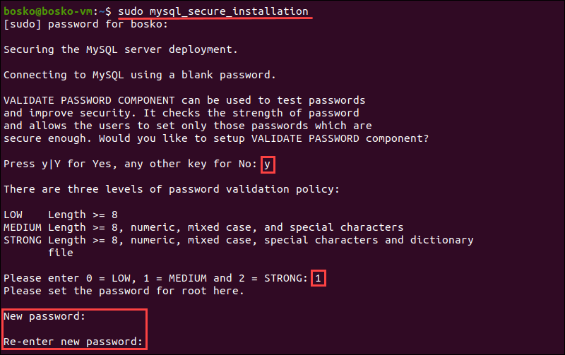

### Install mysql Linux Ubuntu

Steps to install MySql
1. sudo apt install mysql-server
1. mysql --version
1. sudo mysql_secure_installation
1. sudo systemctl status mysql
1. sudo mysql -u root
1. sudo mysql_secure_installation

The script then prompts for the following security features:

Remove anonymous users?
Disallow root login remotely?
Remove test database and access to it?
Reload privilege tables now?
The recommended answer to all these questions is Y. However, if you want a different setting for any reason, enter any other key.

### Check if MySQL Service Is Running
Upon successfully installing MySQL, the MySQL service starts automatically.

Verify that the MySQL server is running by running:

sudo systemctl status mysql

Finally we get into
sudo mysql -u root

Reference : https://phoenixnap.com/kb/install-mysql-ubuntu-20-04

---

### Fix MySQL to use vault as dynamic credentials
A new version of MySQL does it this way
In the new MySQL client, if the password is left empty while installing then, it is based on the auth_socket plugin.

The correct way is to log in to MySQL with the sudo privilege.

steps:
1. sudo mysql -u root -p
And then updating the password using:

1. ALTER USER 'root'@'localhost' IDENTIFIED WITH mysql_native_password BY 'new-password';

    **Once this is done, stop and start the MySQL server.**

1. sudo service mysql stop
1. sudo service mysql start
